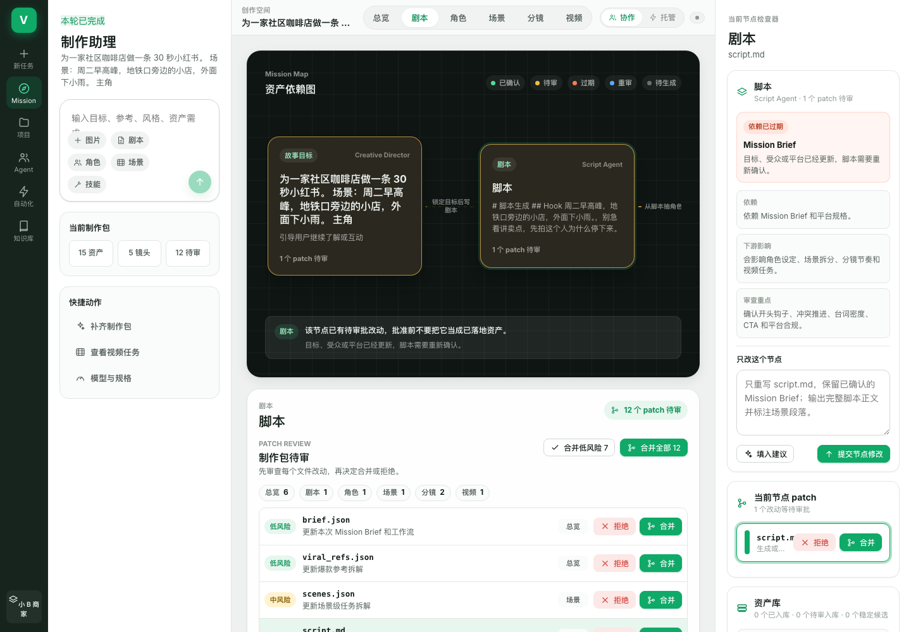

# VideoAgent Code · AI 短视频制作工作台

一句话描述你想要的视频，AI Agent 帮你从**剧本 → 角色 → 场景 → 分镜 → 视频片段 → 成片**一步步做出来。每一步的产出都要你确认后才进入下一步，改了上游，下游会自动标记「已过期」提醒你重做。

交互方式参考了 Claude Code：Agent 提出修改（patch），你来审阅、合并或拒绝。



## 能做什么

- **多种内容类型**：产品营销视频、短剧 / 剧情视频、旧稿改写、图文笔记、一周内容计划、多平台改写（小红书 / 抖音 / TikTok）
- **分阶段制作**：剧本 → 角色设定 → 场景 → 分镜 → 视频，每个阶段单独生成、审阅、确认
- **资产依赖图**：可视化看到每个素材依赖谁、影响谁，上游变了下游自动标「过期」
- **Patch 审阅**：Agent 的每处改动都以 diff 形式给你看，可按风险等级批量合并
- **生图 / 生视频**：接入图片和视频模型，为角色、场景出图，按分镜渲染视频片段
- **画面质检（可选）**：用多模态模型抽帧检查手指、穿模、换脸等问题，不合格自动重渲
- **成片合成**：用 ffmpeg 把片段拼成一个完整视频，可烧录字幕
- **内置技能库**：导演手法、提示词工程、内容风险检测等方法论（见 `skills/` 目录）
- **项目保存**：项目存在本机 `data/projects/`，刷新不丢

## 快速开始

### 1. 准备环境

- [Node.js](https://nodejs.org/) 20 或以上
- （可选）合成成片需要 ffmpeg，macOS 安装方式：`brew install ffmpeg`

### 2. 下载并安装

```bash
git clone https://github.com/wobuhuixiedaimacheng/videoagent-code-online-live-cn-custom.git
cd videoagent-code-online-live-cn-custom
cp .env.example .env.local
npm install
```

> 项目的 `.npmrc` 默认使用国内镜像（npmmirror），国内安装会比较快。

### 3. 启动

```bash
npm run dev
```

浏览器打开 <http://localhost:3000>。

终端窗口不要关，关了网页就打不开了。停止运行按 `Control + C`。

**不填任何 API Key 也能打开**，会用本地生成器运行，可以先熟悉界面和流程。

## 配置 AI 模型

要真正生成内容，需要配置模型。有两种方式，任选其一。

### 方式 A：在网页里配置（推荐新手）

打开页面后，点左侧「快捷动作」里的 **模型与规格**，填入：

- API Key
- Base URL（服务商提供的接口地址，一般以 `/v1` 结尾）
- 文本模型、图片模型、视频模型的名称

点「保存配置」即可。

### 方式 B：编辑 `.env.local`

用文本编辑器打开项目根目录的 `.env.local`，按需填写。

**任意兼容 OpenAI 接口的服务**（DeepSeek、通义、Moonshot、OpenRouter、各类中转等）：

```env
DEFAULT_PROVIDER=custom
CUSTOM_API_KEY=你的_key
CUSTOM_BASE_URL=https://服务商地址/v1
CUSTOM_MODEL=模型名称
```

**Anthropic Claude**：

```env
ANTHROPIC_API_KEY=你的_key
ANTHROPIC_MODEL=claude-sonnet-4-5
```

**OpenAI**：

```env
OPENAI_API_KEY=你的_key
OPENAI_MODEL=gpt-4.1-mini
```

**生图 / 生视频 / 画面质检**分别对应 `IMAGE_*`、`VIDEO_*`、`QA_*` 这几组变量，不填就不启用对应功能。每个变量的详细说明写在 `.env.example` 的注释里。

改完 `.env.local` 后，要重启才生效：按 `Control + C`，再运行 `npm run dev`。

> ⚠️ `.env.local` 里是你的密钥，**不要**发给别人，也不要提交到 Git（项目已默认忽略它）。

## 使用流程

1. 在左侧输入框描述你的需求，例如：「为一家社区咖啡店做一条 30 秒小红书视频，场景是周二早高峰、外面下小雨」
2. 可以附加图片、参考剧本、角色、场景或技能
3. Agent 生成第一版制作包后，在中间的 **Patch 审阅** 区逐条查看，点「合并」或「拒绝」
4. 顶部标签可以在 **剧本 / 角色 / 场景 / 分镜 / 视频** 之间切换，每个阶段确认后解锁下一阶段
5. 想只改某一个环节，就在右侧检查器里写修改意见，点「提交节点修改」
6. 视频阶段渲染出片段后，点合成得到最终成片

## 常见问题

**页面提示「未配置在线模型，当前使用本地生成器」？**
说明没有读到可用的 API Key。检查 `.env.local` 有没有填、填完有没有重启。

**请求失败 / 报错？**
多半是 Base URL 或模型名称写错了。对照服务商文档里的 `base_url` 和 `model id` 再核对一遍。

**生成剧本时超时？**
在 `.env.local` 调大 `AGENT_PROVIDER_TIMEOUT_MS`（单位毫秒，默认 180000，也就是 3 分钟）。

**合成成片提示找不到 ffmpeg？**
安装 ffmpeg 后回到页面，重新点合成即可，已经渲染好的片段不会丢。

## 部署到线上（可选）

项目可以部署到 Vercel 等平台，但要注意：

- 合成成片依赖 ffmpeg，项目档案要写本地磁盘，这两项在 Vercel 这类无服务器平台上**不能正常使用**。完整功能建议部署在有磁盘、能装 ffmpeg 的云服务器上。
- 项目**没有登录系统**，部署到公网后，任何打开网址的人用的都是你的 API Key。一定要设置 `MODEL_CONFIG_ADMIN_TOKEN`，并在服务商后台给 Key 设置用量上限。

## 开发

```bash
npm run typecheck   # 类型检查
npm test            # 单元测试
npm run build       # 生产构建
```

技术栈：Next.js 14 · React 18 · TypeScript · React Flow
